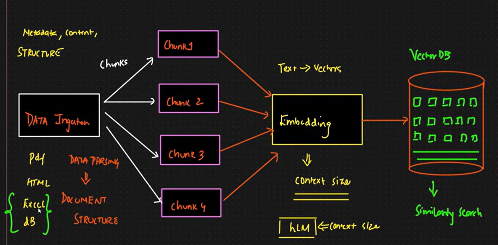
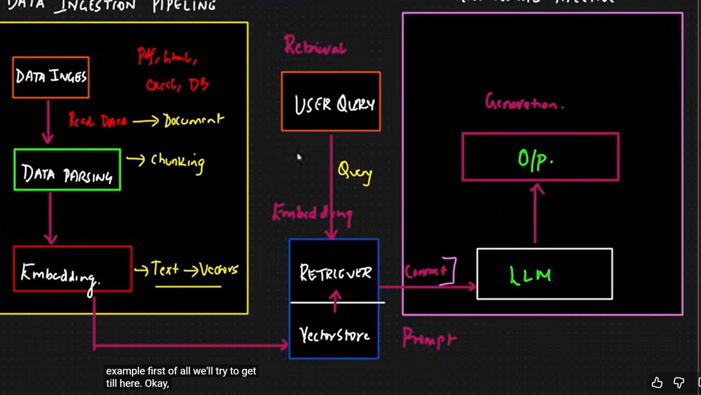
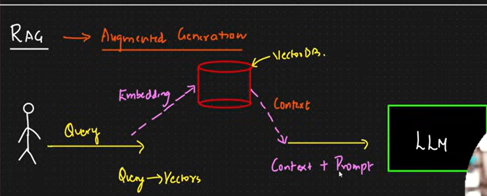

# RAG Pipeline

This project implements a complete Retrieval-Augmented Generation (RAG) pipeline for multi-format documents.

## What this project does

- Loads files from the `data/` (or `CopyOfExam/`) folder.
- Converts them into LangChain `Document` objects.
- Splits text into chunks.
- Generates embeddings.
- Stores vectors + metadata in FAISS.
- Runs similarity search on user query.
- Builds prompt with retrieved context.
- Sends prompt to Groq LLM and returns final answer with citations.

---

## RAG pipeline flow (from `src`)

### 1) Document loading (`src/data_loader.py`)

`load_all_documents(data_dir)` scans recursively and loads:

- PDF (`PyPDFLoader`, fallback `PyMuPDFLoader`, then OCR via `pytesseract`)
- TXT (`TextLoader`)
- CSV (`CSVLoader`)
- Excel (`UnstructuredExcelLoader`)
- DOCX (`Docx2txtLoader`)
- JSON (`JSONLoader`)

All files are normalized into LangChain `Document` objects with metadata like source and page.

### 2) Chunking + embeddings (`src/embedding.py`)

`EmbeddingPipeline`:

- Splits documents using `RecursiveCharacterTextSplitter`
	- `chunk_size=1000`
	- `chunk_overlap=200`
- Embeds chunk text using Sentence Transformers model:
	- `all-MiniLM-L6-v2`

### 3) Vector store build/load (`src/vectorestore.py`)

`FaissVectorStore`:

- Creates FAISS index (`IndexFlatL2`)
- Stores vectors in `faiss.index`
- Stores metadata in `metadata.pkl`
- Persists under `persist_dir` (default `faiss_store`, exam app uses `faiss_store_exam`)

### 4) Retrieval + prompt + LLM (`src/search.py`)

`RAGSearch`:

- Loads existing FAISS index, or rebuilds if missing.
- Runs similarity search with `top_k` chunks.
- Builds context block from retrieved chunk metadata.
- Sends constrained RAG prompt to Groq chat model.

Default LLM model used:

- `openai/gpt-oss-20b` (through `langchain-groq` / `ChatGroq`)

### 5) App entrypoint (`app.py`)

- Uses `CopyOfExam/` as source folder.
- Uses `faiss_store_exam/` as persistent FAISS store.
- If index exists, startup is fast.
- If index is missing, first run builds index (takes longer).

---

## Project structure (important folders)

- `src/` → pipeline code (loader, chunking, embedding, vector store, retrieval)
- `data/` → general dataset files
- `CopyOfExam/` → exam data used by `app.py`
- `faiss_store/`, `faiss_store_exam/` → saved vector indexes
- `.env` → API keys and environment config

---

## Setup

### 1) Create and activate virtual environment (Windows PowerShell)

```powershell
python -m venv .venv
.\.venv\Scripts\Activate.ps1
```

### 2) Install dependencies

```powershell
pip install -r requirements.txt
```

### 3) Configure environment

Add in `.env`:

```env
GROQ_API_KEY=your_groq_api_key
```

---

## Run

Use the project venv Python (recommended):

```powershell
D:/RAG_pipeline/.venv/Scripts/python.exe app.py
```

Then ask queries in terminal, for example:

- `give me 3 question from theory of computation`

---

## Notes

- First run can be slow because embeddings and FAISS index are built.
- Later runs are faster because index is loaded from disk.
- For scanned PDFs, install Tesseract OCR and ensure executable is available.

---

## Learning snapshots (`images/`)

This project also includes personal learning snapshots captured while studying RAG. These are important references and are kept in the `images/` folder.

### Snapshot 1: Foundation of RAG flow



This snapshot represents the base pipeline idea: document ingestion, conversion to structured text, and preparation for retrieval.

### Snapshot 2: Retrieval and context building



This snapshot focuses on retrieval steps: chunk matching, similarity search, and assembling the most relevant context for prompt construction.

### Snapshot 3: Prompting and final answer generation



This snapshot reflects the final stage: sending retrieved context to the LLM with a structured prompt to get clear, complete, grounded answers.

These snapshots align directly with the code in `src/`:

- `data_loader.py` → document loading and normalization
- `embedding.py` → chunking and embeddings
- `vectorestore.py` → FAISS indexing and similarity retrieval
- `search.py` → context assembly + prompt to LLM + response generation

---

## Tech stack

- LangChain / LangChain Community
- Sentence Transformers (`all-MiniLM-L6-v2`)
- FAISS (`faiss-cpu`)
- Groq LLM via `langchain-groq` (`openai/gpt-oss-20b`)
- Python Dotenv
